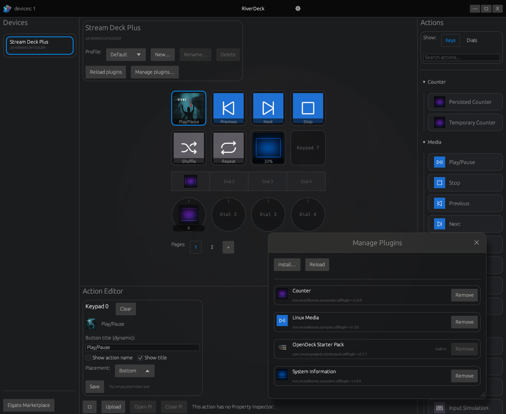

<p align="center">
  
</p>

---

<p align="center">
  <strong>Cross-platform software for your Elgato Stream Deck</strong>
</p>

<p align="center">
  <br>
  <a href="#showcase">More screenshots</a>
</p>

RiverDeck is a desktop application for using stream controller devices like the Elgato Stream Deck on Linux, Windows, and macOS. RiverDeck supports plugins made for the original Stream Deck SDK, allowing many plugins made for the Elgato software ecosystem to be used, or the [OpenAction](https://openaction.amankhanna.me/) API.

Only Elgato hardware is officially supported, but plugins are available for support for other hardware vendors.

RiverDeck is made by Ethan Wright (`sulrwin`) and is forked from OpenDeck. A lot of fundimental components and systems have been changed from OpenDeck, all that would have been impossible without OpenDeck. Thanks to OpenDeck and its contributors for the original work.

Special thanks go to the developers of the [elgato-streamdeck](https://github.com/OpenActionAPI/rust-elgato-streamdeck) Rust library, [Wine](https://www.winehq.org/), and [Phosphor Icons](https://phosphoricons.com/).

### Why use RiverDeck?

- **OpenDeck?**: RiverDeck brings a more modern and sleek interface while implementing a lot of features not found in OpenDeck but can be found in the official software. Along with a few unique features not found in the official software with plans for even more!

- **Stream Deck plugins**: RiverDeck supports the majority of the Stream Deck plugins that users of the Elgato ecosystem are already familiar with, unlike other third-party softwares which are much more limited (e.g. streamdeck-ui, StreamController, Boatswain etc).
- **Cross-platform**: RiverDeck supports Linux alongside Windows and macOS. macOS users also benefit from switching from the first-party Elgato software as RiverDeck can run plugins only built for Windows on Linux and macOS thanks to Wine. Additionally, profile files are easily moveable between platforms with no changes to them necessary.
- **Feature-packed**: From Multi Actions and Toggle Actions to switching profiles when you switch apps and brightness control, RiverDeck has all the features you'd expect from stream controller software.
- **Open source**: RiverDeck source code is licensed under the GNU General Public License, allowing anyone to view it and improve it for feature, stability, privacy or security reasons.
- **Written in Rust**: RiverDeck is built in Rust for performance and safety. (Some built-in plugin build scripts are written in TypeScript and run via Deno.)

## Installation

### Linux

> [!TIP]
> If you're using a Debian, Ubuntu, Fedora, Fedora Atomic, openSUSE or Arch-based distribution, you can try the new automated installation script:
> ```bash
> bash <(curl -sSL https://raw.githubusercontent.com/sulrwin/RiverDeck/main/install_riverdeck.sh)
> ```
> The script installs RiverDeck from a released .deb or .rpm file, the AUR, or Flathub (if available), appropriately, and also installs and reloads the appropriate udev subsystem rules. Additionally, you can choose to install Wine from your distribution during the process.

- Download the latest release from [GitHub Releases](https://github.com/sulrwin/RiverDeck/releases/latest).
- Install RiverDeck using your package manager of choice.
- Install the appropriate udev subsystem rules from [here](https://raw.githubusercontent.com/OpenActionAPI/rust-elgato-streamdeck/main/40-streamdeck.rules):
	- If you're using a `.deb` or `.rpm` release artifact, this file should be installed automatically.
	- Otherwise, download and copy it to the correct location with `sudo cp 40-streamdeck.rules /etc/udev/rules.d/`.
	- In both cases, you will need to reload your udev subsystem rules with `sudo udevadm control --reload-rules && sudo udevadm trigger`.
- If you intend to use plugins that are not compiled for Linux (which are the majority of plugins), you will need to have [Wine](https://www.winehq.org/) installed on your system. Some plugins may also depend on Wine Mono (which is sometimes, but not always included, in your distro's packaging of Wine).

> [!NOTE]
> If Flatpak is your only option, check whether RiverDeck is available on Flathub. Please note that you still need to install the udev subsystem rules as described above. To use Windows plugins, you should have Wine installed natively (the Wine Flatpak is not supported).

### Windows

- Download the latest release (`.exe` or `.msi`) from [GitHub Releases](https://github.com/sulrwin/RiverDeck/releases/latest).
- Double-click the downloaded file to run the installer.

### macOS

- Download the latest release from [GitHub Releases](https://github.com/sulrwin/RiverDeck/releases/latest).
- If you downloaded a `.dmg`, open the downloaded disk image and drag the application inside into your Applications folder; otherwise, extract the `.tar.gz` to your Applications folder.
- Open the installed application. Note: if you receive a warning about RiverDeck being distributed by an unknown developer, *right-click the app in Finder and then click Open* to suppress the warning.
- If you intend to use plugins that are only compiled for Windows, you will need to have [Wine](https://www.winehq.org/) installed on your system.

## Support

### How do I...?

To edit an action's settings, left-click on it to display its *property inspector*. To remove an action, right-click on it and choose "Delete" from the context menu.

To edit an action's appearance, right-click on it and select "Edit" from the context menu. You can then customise the image and text for each of its states. Left-click on the image to choose an image from your filesystem or right-click on the image to reset it to the plugin-provided default.

To select another device, or to switch profiles, use the dropdowns in the top right corner. You can organise profiles into folders by prefixing the profile name with the folder name and a forward slash. You can also configure automatically switching to a profile when a specific application's window is active.

To change other options, open Settings. From here, you can also view information about your version of RiverDeck or open the configuration and log directories. To add or remove plugins, visit the Plugins tab.

### Troubleshooting

- Ensure you are running the latest version of RiverDeck, as well as recent versions of related software (e.g. Spotify or OBS, or your operating system and Wine).
- Check the pinned [GitHub Issues](https://github.com/sulrwin/RiverDeck/issues) to see if there's a fix for your problem already.
- Check the RiverDeck log file for any important messages. This file should be included with any support request.
	- You can also run RiverDeck from the terminal to see the logs directly if it's easier than finding the log file or if the log file is empty or missing details.
	- For issues with plugins, you can also check the plugin's logs (in the same folder, sometimes as well as a file named `plugin.log` or similar in the plugin's own folder).
	- The log directory can be opened from the settings page of RiverDeck, or alternatively located manually at paths similar to the below:
		- Linux: `~/.local/share/io.github.sulrwin.riverdeck/logs/`
		- Flatpak: `~/.var/app/io.github.sulrwin.riverdeck/data/io.github.sulrwin.riverdeck/logs/`
		- Windows: `%APPDATA%\io.github.sulrwin.riverdeck\logs\`
		- macOS: `~/Library/Application Support/io.github.sulrwin.riverdeck/logs/`
- When trying to run plugins built for Windows (which are the majority of plugins) on Linux or macOS, please ensure you have the latest version of Wine (and Wine Mono) installed on your system.
- If your device isn't showing up, ensure you have the correct permissions to access it (e.g. on Linux, installing udev subsystem rules and restarting your system), and that you have restarted RiverDeck since connecting it.

### Support forums

- [GitHub Issues](https://github.com/sulrwin/RiverDeck/issues)

### Building from source / contributing

> [!TIP]
> The development guide for agents present in [AGENTS.md](AGENTS.md) also serves as a useful introduction to the codebase for humans.

RiverDeck's UI is a native Rust/egui application. To build/run it you just need a Rust toolchain (and on Linux, `libudev` for Stream Deck access, plus WebKitGTK deps for the `riverdeck-pi` webview helper).

- Run the egui app: `cargo run -p riverdeck-egui`
- Build binaries: `cargo build -p riverdeck-egui -p riverdeck-pi`

On Linux, the default `riverdeck-egui` build enables tray support, which requires the system library **`libxdo`**:
- Arch: `sudo pacman -S --needed xdotool`
- Debian/Ubuntu: `sudo apt-get install -y libxdo-dev`
- Or disable tray support: `cargo build -p riverdeck-egui --no-default-features`

RiverDeck no longer depends on Tauri.

Before each commit, please ensure that all of the following are completed:
1. Rust code has been linted using `cargo clippy --workspace --all-targets -- -D warnings`
2. Rust code has been formatted using `cargo fmt --all`

When submitting contributions, please adhere to the [Conventional Commits specification](https://conventionalcommits.org/) for commit messages. You will also need to [sign your commits](https://docs.github.com/en/authentication/managing-commit-signature-verification/signing-commits). Feel free to reach out on the support channels above for guidance when contributing!

RiverDeck is licensed under the GNU General Public License version 3.0 or later. For more details, see the LICENSE.md file.
